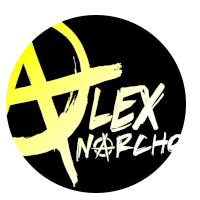
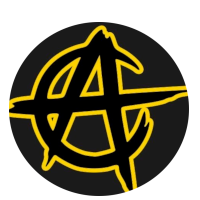
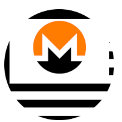
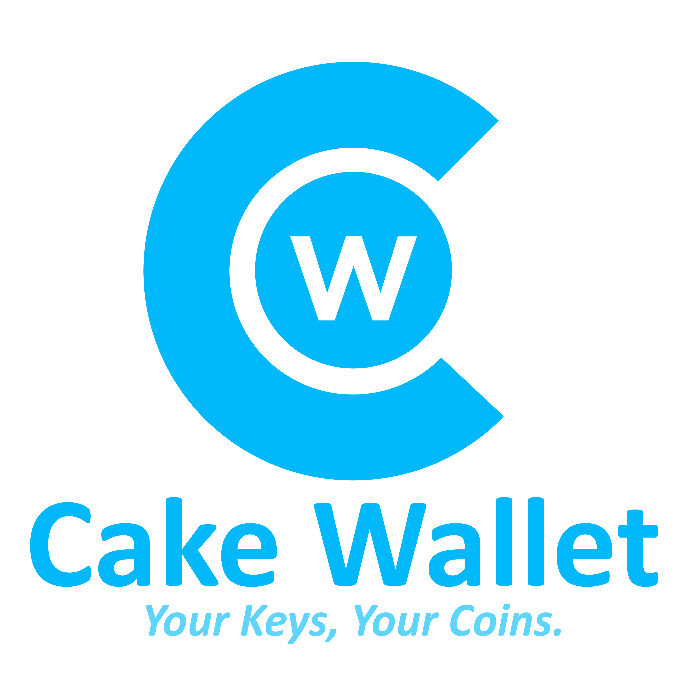
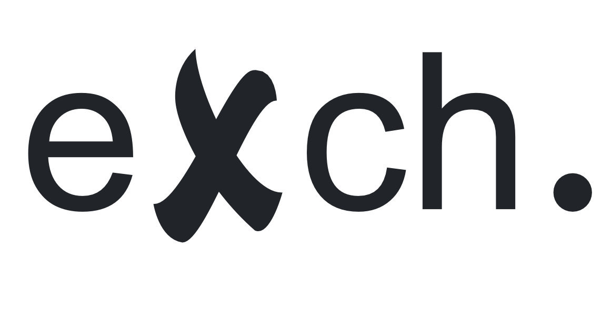

### A conference & hackathon in privacy-enhancing technologies and distributed systems
Monero Konferenco ("MoneroKon") is an annual meeting of privacy advocates, cypherpunks, researchers, and developers and is designed to disseminate scientific and technical results in privacy-enhancing technologies and distributed systems. Marking its fourth year, the upcoming 3-day event will be held once again at the renowned Paralelní Polis in the Czech Republic from 7th-9th of June 2024. Come participate in discussions and help us move privacy forward one conversation at a time.

<a href="https://tickets.monerokon.org"><button class="button" style="vertical-align:middle">Buy Ticket</button></a>  <a href="https://apply.monerokon.org"><button class="button" style="vertical-align:middle">Submit Proposal</button></a> <a href="/hackathon"><button class="button" style="vertical-align:middle">Register as Hacker</button></a>

### Confirmed Speakers

|              |               |               |
| ------------ | ------------- | ------------- |
| {: width="150px" style="text-align:center" }  <b>Aaron Feickert</b> Cypher Stack | {: width="150px" style="text-align:center" }  <b>AlexAnarcho</b> alexanarcho.live | {: width="150px" style="text-align:center" }  <b>Alexis Roussel</b> bity.com |
| {: width="150px" style="text-align:center" }  <b>Amir Taaki</b> Dark.fi | {: width="150px" style="text-align:center" }  <b>Evgeny Poberezkin</b> SimpleX Chat | {: width="150px" style="text-align:center" }  <b>Mark Simkin</b> Ethereum Foundation |
| {: width="150px" style="text-align:center" }  <b>Luke 'Kayaba' Parker</b> serai.exchange | {: width="150px" style="text-align:center" }  <b>andrea</b> Monero Policy Workgroup | {: width="150px" style="text-align:center" }  <b>Ryan</b> monerica.com |
| {: width="150px" style="text-align:center" }  <b>Rucknium</b> Monero Research Lab | {: width="150px" style="text-align:center" }  <b>recanman</b> The Monero Standard | {: width="150px" style="text-align:center" }  <b>jeffro256</b> Monero Dev |
| {: width="150px" style="text-align:center" }  <b>Andriy Khavryuchenko</b> Hacker, Ancap | {: width="150px" style="text-align:center" }  <b>moneromooo</b> Townforge | {: width="150px" style="text-align:center" }  <b>Juraj Bednar</b> Cypherpunk, Co-Founder of Paralelní Polis |
| {: width="150px" style="text-align:center" }  <b>Michael 'exiledsurfer' Parenti</b> CryptoRealist, Co-Founder of Parallele Polis |  | |

### Volunteers

We need lots of help to get this community-driven event off the ground, from graphic designers, help with attendee registration, to stagehands. If you would like to volunteer in some capacity, sign up [here](https://volunteer.monerokon.org).

### MoneroKon 2024 Sponsors

|              |               | 
| ------------ | ------------- |
| [{: width="200px" style="text-align:center" }](https://cakewallet.com) | [{: width="200px" style="text-align:center" }](https://exch.cx)    |
| [{: width="150px" style="text-align:center" }](https://nymtech.net) | [{: width="150px" style="text-align:center" }](https://ivpn.net)    |
| [{: width="150px" style="text-align:center" }](https://exolix.com)       | [{: width="150px" style="text-align:center" }](https://trocador.app)    |
| [{: width="100px" style="text-align:center" }](https://vostoemisio.com)       | [{: width="100px" style="text-align:center" }](https://www.digilol.net)          |

### Become a Sponsor

Our commitment to a grassroots atmosphere and ticket price accessibility, sets us apart from hyper-commercialized events in the space. Generous support of sponsors makes this possible. Explore our sponsorship offerings [here](https://monerokon.org/sponsor).

