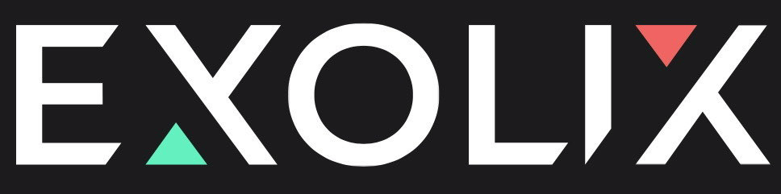
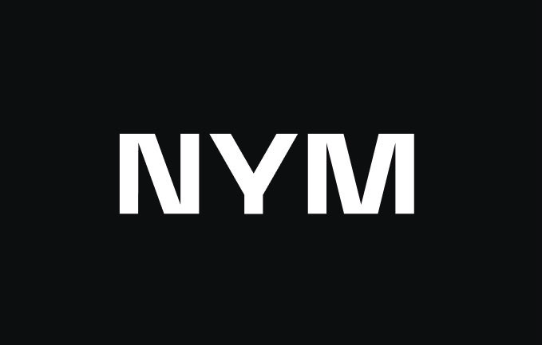
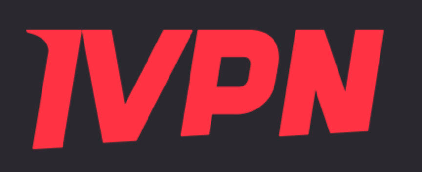
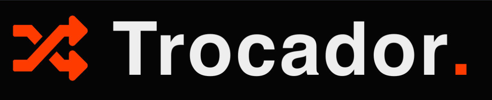
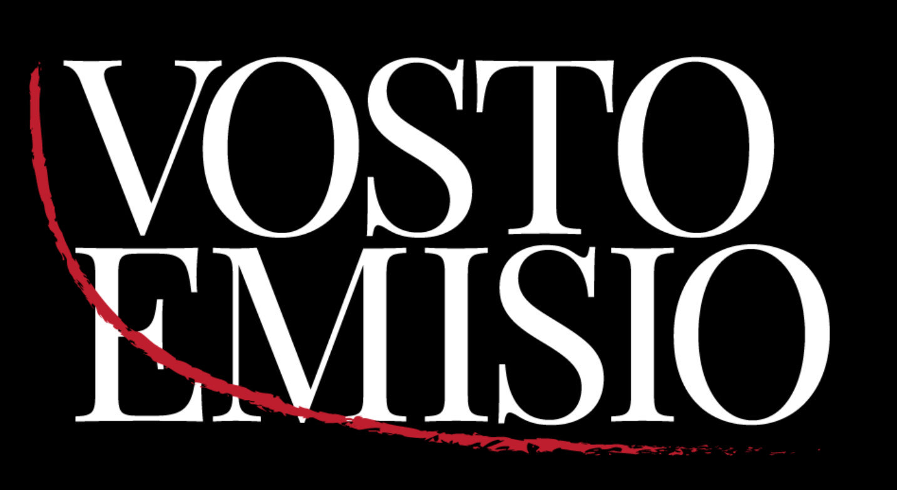
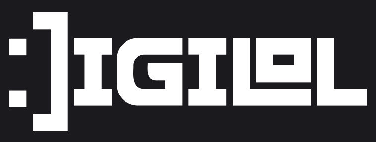

### A conference in privacy-enhancing technologies and distributed systems
Monero Konferenco ("MoneroKon") is an annual meeting of privacy advocates, cypherpunks, researchers, and developers and is designed to disseminate scientific and technical results in privacy-enhancing technologies and distributed systems. Marking its fourth year, the upcoming 3-day event will be held once again at the renowned Paralelní Polis in the Czech Republic from 7th-9th of June 2024. Come participate in discussions and help us move privacy forward one conversation at a time.

<a href="https://tickets.monerokon.org"><button class="button" style="vertical-align:middle">Buy Ticket</button></a>  <a href="https://apply.monerokon.org"><button class="button" style="vertical-align:middle">Submit Proposal</button></a>

### Volunteers

We need lots of help to get this community-driven event off the ground, from graphic designers, help with attendee registration, to stagehands. If you would like to volunteer in some capacity, sign up [here](https://volunteer.monerokon.org).

### MoneroKon 2024 Sponsors

[{: width="200px" style="text-align:center" }](https://cakewallet.com)

[{: width="150px" style="text-align:center" }](https://exolix.com) 

[{: width="150px" style="text-align:center" }](https://nymtech.net)

[{: width="150px" style="text-align:center" }](https://ivpn.net)

[{: width="150px" style="text-align:center" }](https://trocador.app)

[{: width="100px" style="text-align:left" }](https://vostoemisio.com) [{: width="100px" style="text-align:right" }](https://www.digilol.net)

### Become a Sponsor

Our commitment to a grassroots atmosphere and ticket price accessibility, sets us apart from hyper-commercialized events in the space. Generous support of sponsors makes this possible. Explore our sponsorship offerings [here](https://monerokon.org/sponsor).

