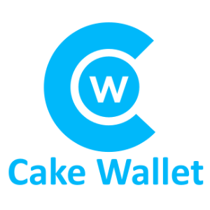
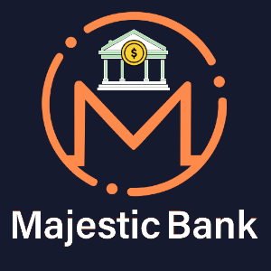
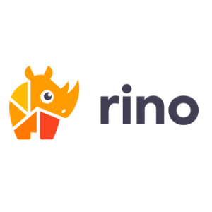

### A technical conference in privacy and financial technology
Monero Konferenco is an annual meeting of privacy advocates, cypherpunks, scientists, and philosophers and is designed to disseminate scientific and technical results in privacy and financial technologies like censorship-resistant digital cash. The event is funded by generous donations from the Monero community and support from sponsors. Come participate in discussions, make a proposal, and help us move privacy forward one conversation at a time. A cashless society lacking basic financial privacy can not remain an open society for long.

[Ticket Waiting List](https://d1131e84.sibforms.com/serve/MUIEAIDyBPkU3xE5879Y9LCcF_C54ZSRgkalDyG-E4MHimQ9v5WsbMM4fPQpYFYY9Vy9GlzgXO3YG2MkjTC8NySDB9QkJzl1fv2BPE_xl28d48OU3DLCz5jlE22mEKFW8DfnM6SctecIl4-4TCo5dPoRnTRzenjSFE_jKwsq_3k5ImzPctBKO9dW6lwMM4yBhP6SoPSFGv0WfbQn){: .btn-success target="_blank"} [Call for Presentations](https://cfp.monerokon.com/2023/cfp){: .btn-success target="_blank"}

## Cypherpunk Heroes

<a href="https://rino.io">
## Contributors
- [IVPN](https://www.ivpn.net)
- [Digilol](https://digilol.net)
- [CicadaBank](https://cicadabank.com)

## Supporter
- Company name here

### Sponsorship

If your company would like to be a sponsor of MoneroKon 2023, check out the available Conference Sponsorship Packages [here](https://monerokon.com/sponsor).

### Volunteers

We need lots of help to get this community-driven event off the ground, from graphic designers, help with attendee registration, to stagehands. If you would like to volunteer in some capacity (and get a free ticket + merch in the process), fill out the form [here](https://cryptpad.disroot.org/form/#/2/form/view/Z8v7RE0D+Axf+54kTA-otpnJ-Krlfs8gJwoktERKUrM/embed/).

### Safety and Security

All life forms, regardless of their age, gender or upbringing are welcomed at Monero Konferenco.

We are dedicated to providing a safe and comfortable experience for everybody attending our events, regardless of age, gender, sexual orientation, race, physical appearance or disability. We do not tolerate harassment of participants of the Konferenco in any form. We don't tolerate life forms who refuse to share this openness towards others.

The Konferenco will always be a place where people can enjoy technology and culture, no matter what their background is. To keep it that way: If someone is misbehaving and you want support, let a Konferenco volunteer know, they will be glad to help. Have the courage to ask us!

### Photo Policy

Ask before snapping, all persons in a photo/video must have explicitly given consent to be photographed/recorded. As such, please avoid taking photos/video of large crowds, audience, or workshop participants.

### Past Events

#### Lisbon 2022
*  [Slides](https://github.com/MoneroKon/meta/blob/main/slides/2022/talks.md)
*  [Videos](https://www.youtube.com/playlist?list=PLsSYUeVwrHBndRQoQ-vLezzlHPLRDNzaw)
*  Sponsors
   - [RINO](https://rino.io)
   - [Cake Wallet](https://cakewallet.com)
   - [IVPN](https://www.ivpn.net)
   - [MajesticBank](https://majesticbank.sc)
   - [Sweetwater Digital Asset Consulting, LLC](https://sweetwater.consulting)
   - [CicadaBank](https://cicadabank.com)
  
#### Denver 2019
*  [Videos](https://www.youtube.com/playlist?list=PLsSYUeVwrHBkJHJg_l2uDgbicDJ1PmAVW)
*  Sponsors
   - [Cypher Market](https://www.cyphermarket.com)
   - [Tari](https://www.tari.com)
   - XMR.to
   - [Symas](https://www.symas.com)
   - [Monero Talk](https://www.monerotalk.live)
   - MorphToken
   - [Core Scientific](https://corescientific.com)
   - [Cake Wallet](https://cakewallet.com)
   - [MyMonero](https://mymonero.com)
   - [Magic Grants](https://magicgrants.org)
   - [INSIGHT](https://www.insight.com)
   - [GloBee](https://globee.com)
  
