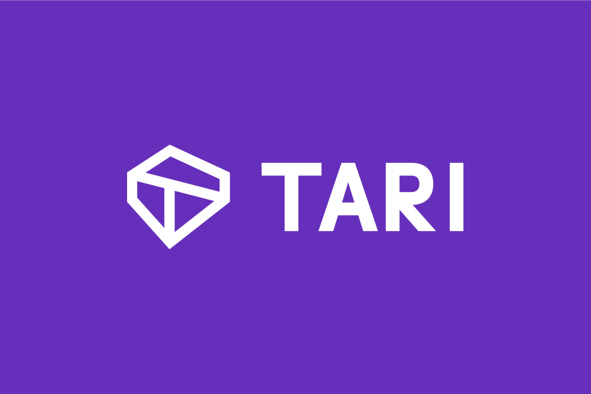
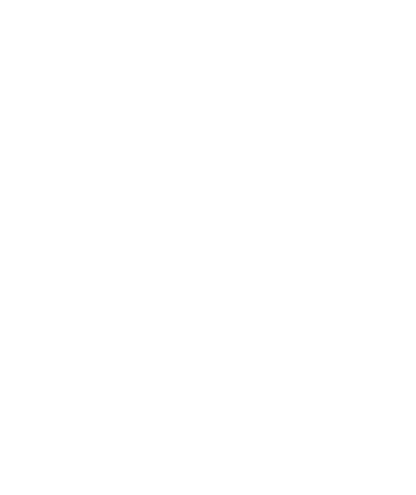
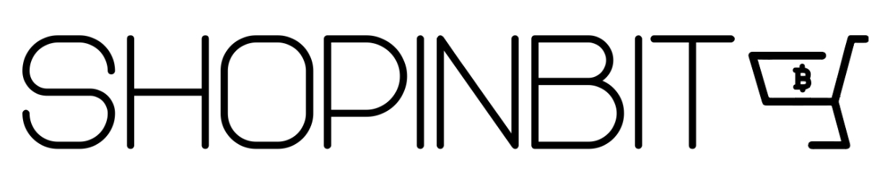
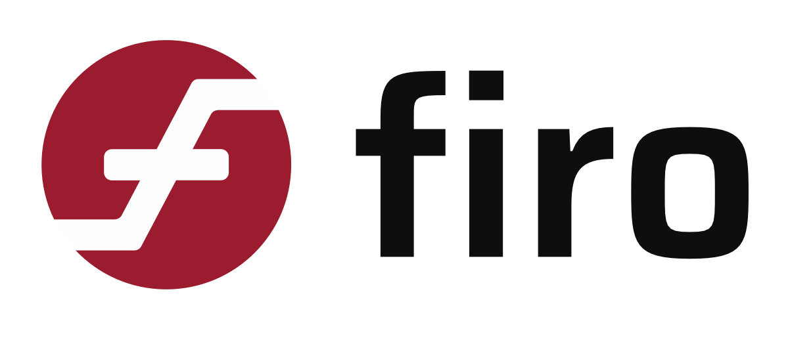

### A conference & hackathon in privacy-enhancing technologies and distributed systems
Monero Konferenco ("MoneroKon") is an annual meeting of privacy advocates, cypherpunks, researchers, and developers and is designed to disseminate scientific and technical results in privacy-enhancing technologies and distributed systems. Marking its fourth year, the upcoming 3-day event will be held once again at the renowned Paralelní Polis in the Czech Republic from 7th-9th of June 2024. Come participate in discussions and help us move privacy forward one conversation at a time.

<a href="https://cfp.monerokon.org/2024/schedule"><button class="button" style="vertical-align:middle">View Schedule</button></a><a href="https://shop.monerokon.org/monerokon/2024/"><button class="button" style="vertical-align:middle">Buy Ticket</button></a>  <a href="https://monerokon.devfolio.co"><button class="button" style="vertical-align:middle">Apply to Hack</button></a>

### Volunteers

We need lots of help to get this community-driven event off the ground, from graphic designers, help with attendee registration, to stagehands. If you would like to volunteer in some capacity, sign up [here](https://cryptpad.fr/form/#/2/form/view/Y33REJzsGXOwxnC92JDuzGis+B4XVfaWGPLSioJlKVo).

### MoneroKon 2024 Sponsors

|              |               | 
| ------------ | ------------- |
| [{: width="200px" style="text-align:center" }](https://cakewallet.com) | [{: width="200px" style="text-align:center" }](https://exch.cx)    |
| [{: width="150px" style="text-align:center" }](https://nymtech.net) | [{: width="150px" style="text-align:center" }](https://ivpn.net)    |
| [{: width="150px" style="text-align:center" }](https://exolix.com)       | [{: width="150px" style="text-align:center" }](https://trocador.app)    |
| [{: width="150px" style="text-align:center" }](https://tari.com)       | [{: width="150px" style="text-align:center" }](https://waku.org) |
| [{: width="150px" style="text-align:center" }](https://shopinbit.com)       |  |
| [{: width="100px" style="text-align:center" }](https://vostoemisio.com)       | [{: width="100px" style="text-align:center" }](https://www.digilol.net)          |
| [{: width="100px" style="text-align:center" }](https://firo.org)       |           |
